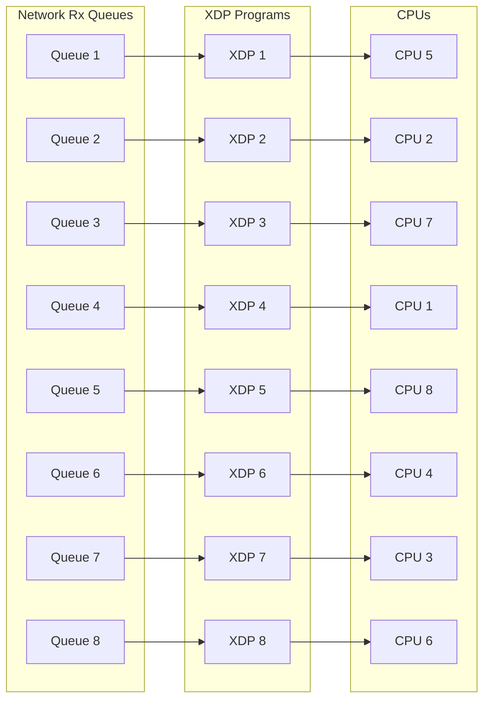

# Lab 1

Welcome to Lab 1. In this lab, we will study scheduling algorithms for packet
processing with diverse traffic patterns. To build this lab, follow the
instructions below.

## Dependencies

Use a relatively recent Ubuntu version, like 23.10 or above.

For Ubuntu, install the following dependencies:

```bash
$ sudo apt install build-essential libgtest-dev libgcc-13-dev \
    libstdc++-13-dev libelf-dev zlib1g-dev gcc clang cmake ninja-build \
    bear libbenchmark-dev pkg-config
```

For other distributions, search for packages providing equivalent support.

## Building

```bash
$ git submodule update --init
$ ./build.sh
```

## Introduction

In this lab, we will write a packet scheduler for a server that will run using
the XDP eBPF program type. Based upon the previous lab, you should be
comfortable with writing XDP programs, using BPF maps, and using
`bpf_redirect_map` helper to redirect packets to a destination CPU.

We will handle various traffic patterns to ensure that the latency of requests
that are being handled remains low, while ensuring all CPUs are properly
utilized so that we are not wasting available computational resources.

The task of a packet scheduler is to assign incoming packets to CPUs processing
them, and achieve lower latency and higher throughput. An appropriate packet
scheduling policy can avoid various inefficiencies that are seen in deployed
systems, such as head of line blocking, and high queueing delays. We provide
a definition of these terms below, but encourage you to read more about them
through your own research.

 * Queueing Delay: This is the time a packet sits waiting in the queue (or
   multiple queues) before it is finally processed by a server. In a packet's
   typical journey, it may be queued in the NIC (Network Device), then in the
   packet scheduler, and finally in the application which is processing incoming
   packets. The total time spent from its arrival until when it is finally
   processed is called the queueing delay. For this lab, we will refer to the
   queueing delay as the time spent by the packet when it first arrived at our
   packet scheduler program to the time when it was processed by the server to
   which we assign a given incoming packet.

 * Head of Line Blocking: This phenomenon occurs when a request that takes a
   long time to be processed is assigned to a server on a CPU with a lot of
   requests with a short service time behind it. All of the requests with a
   shorter service time thus need to wait for the long request to be processed
   before they can be processed.

The way our setup will look is as follows.



The incoming traffic will hit network device's Rx queues, and then the XDP
program will be invoked for each packet in the network driver. In this program,
our policy to schedule packets will redirect them to a different CPU depending
on the objectives we want to achieve. In this example, you can see packets being
directed to a non-local CPU (Rx Queues and XDP program numberings map to the CPU
they are originally corresponding to).

## Traffic Patterns

We provide two client scripts to generate two kinds of traffic patterns for this
lab.

 * `client_unimodal.sh`: This script sends a traffic pattern with requests that
   will be processed by the backend server, and have a uniform service time
   (i.e. take similar time to be processed, around 10 us).

 * `client_bimodal.sh`: This script sends a traffic pattern with requests that
   will be processed by the backend server, and have a either a short service
   time (1 us) or a longer service time (around 10 us). 90% of the sent requests
   will be short, while the remaining 10% will be long.
 
 * `client_debug.sh`: This script sends bimodal traffic at a reduced and 
   constant throughput. This may be useful for debugging, as it will produce
   less user space logs and less output to 
   `/sys/kernel/debug/tracing/trace_pipe` in the case that you are using 
   `bpf_printk` in your xdp programs.

Intuitively, you can realize that mixing requests with short and long service
times on the same core may lead to the head-of-line blocking scenario we
described earlier, while the same would not occur for uniform service time
requests.

The clients follow a pattern for 5-second windows and keep doubling the traffic
rate, thus exercising different patterns of traffic and climbing the CPU
utilization on the server.

## Exercise 1 - Round Robin (RR)

In this first exercise, you will implement a Round Robin policy for the packet
scheduler by filling in the `bpf_redirect_roundrobin` XDP program in the
`bpfnic.bpf.c` file. You will fill in your logic after the TODO comment.

The `cpu_iter` BPF map contains a single value at key 0. When performing a map
lookup (using `bpf_map_lookup_elem`), you can retrieve a pointer to this value.

This value will be used to pick the CPU to redirect the packet to, and increment
it to point to the next CPU.

Remember to also retrieve the maximum CPU count (from the `cpus_count` BPF map,
again at key 0) to ensure you wrap the iterator around back to 0.

Upon picking a CPU, you must check whether it is available for
redirecting in the `cpus_available` map, where the key corresponds to the CPU
number. If not, you must return `XDP_ABORTED` error code.

Finally, you can use `bpf_redirect_map` and the `cpu_map` BPF map as the first
argument, the CPU number that you want to redirect to as the second argument,
and flags as 0 to perform a redirection.

Ensure that the returned value from the helper (`XDP_REDIRECT`) is as expected,
otherwise you may have triggered an error. Remember to return this redirect
value from the XDP program to complete the redirection to the destination CPU.

In this policy, you simply send packets to all available cores in a round robin
fashion, regardless of the request's type (long or short).

**NOTE:** For all other cases not mentioned above (such as `bpf_map_lookup_elem` 
returns `NULL` or the bound check fails), the default option is `XDP_DROP`. This 
default option remains the same for the next two exercises.

## Evaluation

### How to evaluate
1. Invoke the server script, using `sudo ./server_default_rr.sh`.
2. Invoke scripts for both unimodal and bimodal traffic as described
earlier from a separate terminal.

The client benchmark in unimodal and bimodal mode will run the experiment for 30 
seconds, where it will increase load exponentially at an interval of 5 seconds. 
The provided server script for this benchmark (`server_default_rr.sh`) attaches 
the XDP programs for 60 seconds before detaching. This can be configured via
the option `-d`. For more information, consult `./bpfnic --help`.

### What you need to do
1. Evaluate and document the results you see for queueing delay and
round trip time (RTT) as seen on the server and client respectively, for both
unimodal and bimodal traffic.
2. Explain the effect of the packet scheduling policy for
both kinds of traffic, and provide a convincing explanation for why that
happens.

### Helpful gadgets
The client scripts generate two files, i.e., `output_qd.csv` and `output_rtt.csv`,
and we provide a script, `visualize_output.ipynb` to produce plots for both. You
will use these plots to explain the results in your report.

## Exercise 2 - Round Robin Core Separated (RRCS)

In this second exercise, you will implement a Round Robin Core Separated policy
for the packet scheduler by filling in the
`bpf_redirect_roundrobin_core_separated` XDP program in the `bpfnic.bpf.c`
file. You will fill in your logic after the TODO comment.

In this policy, long requests and short requests are supposed to be sent to a
subset of available cores (8).

Like the last exercise, you now have separate maps for available CPUs for short
and long requests (`cpus_available_long_reqs`, `cpus_available_short_reqs`), and
separate keys at which iterators for each request type are located in the
`cpu_iter_core_separated` BPF map. Finally, the maximum CPU count for both
request types are available in different keys in the `cpu_count_core_separated`
BPF map.

In this policy, you need to detect the request type and perform a redirection
based on the type of request. To detect the request type, you must cast the
`hdr_cursor`'s `pos` field to a `struct packet` pointer, and then perform a
bounds check to read the `data` field. If the value is greater or equal to `10`, 
the request is a long one, otherwise it's a short one.

Accordingly, you will then redirect the long ones to CPUs dedicated to them, and
the short ones to the CPUs dedicated for their processing, like the previous
example. In some sense, the total CPUs are now divided into two separate groups
of CPU cores, and we are performing round robin packet scheduling in each of
them.

## Evaluation

### How to evaluate
1. Invoke the server script, using `sudo ./server_default_rrcs.sh`.
2. Invoke scripts for both unimodal and bimodal traffic as described
earlier from a separate terminal.

The client benchmark in unimodal and bimodal mode will run the experiment for 30 
seconds, where it will increase load exponentially at an interval of 5 seconds. 
The provided server script for this benchmark (`server_default_rrcs.sh`) 
attaches the XDP programs for 60 seconds before detaching. This can be 
configured via the option `-d`. For more information, consult `./bpfnic --help`.

### What you need to do
1. Evaluate and document the results you see for queueing delay and
round trip time (RTT) as seen on the server and client respectively, for both
unimodal and bimodal traffic.
2. Explain the effect of the packet scheduling policy for
both kinds of traffic, and provide a convincing explanation for why that
happens.

### Helpful gadgets
The client scripts generate two files, i.e., `output_qd.csv` and `output_rtt.csv`,
and we provide a script, `visualize_output.ipynb` to produce plots for both. You
will use these plots to explain the results in your report.

## Exercise 3 - Dynamic Core Allocation (DCA)

In this third exercise, you will now shift focus away from the BPF program and
towards user space, which collects the queueing delay metrics. You will use this
to dynamically increase the number of cores available for handling incoming
traffic by monitoring the queueing delay of packets coming into the system.

Therefore, in this particular case, we start with an available core count of 1
CPU, and based on the queueing delay measured, we will keep adding cores until
the queueing delay remains below a certain threshold, or we run out of available
cores to add (technically, reaching the saturation point of the machine).

All modifications must be made to the file `src/ServerBenchmark.cpp`.

In this particular exercise, you have to modify the `addOneCPU` and
`removeOneCPU` functions to update the CPU count in the BPF map represented by
the `countFd` file descriptor. Since we are performing this update from user
space, we need to use the `bpf_map_update_elem` API. The CPU count is stored in
key 0.

We need to keep adding CPUs as long as the count does not exceed `MAX_CPUS`, and
keep removing them as long as it does not go below the `MIN_CPUS` limit. Both
separate functions will handle these cases and update the map, respectively.

Finally, you need to add a decision logic to the
`redirectProgDynamicCoreAllocation` function between the `BEGIN` and `END`
statements to respond by adding cores using the above API when the queueing
delay crosses a certain threshold. You can use the `computeAverageQueueingDelay`
with the parameters `totalSrvTimeFd` and `txCtrFd` to obtain the queueing delay
average in nanoseconds.

The threshold value is something you will have to choose, but as an example, one
valid threshold could be 50 us. Any reasonable value where you can demonstrate
that core additions are performed with increasing traffic will suffice for this
exercise.

The end goal of this exercise is to demonstrate how a server can respond to
increase in traffic load without wasting all CPUs for peak demand initially, and
gracefully add capacity on the server side to maintain a certain queueing delay,
and provide a reasonable client-side latency.

## Evaluation

### How to evaluate
1. Invoke the server script, using `sudo
./server_default_dynamic_alloc.sh`.
2. Invoke scripts for both unimodal and bimodal traffic as described
earlier from a separate terminal.

The client benchmark in unimodal and bimodal mode will run the experiment for 30 
seconds, where it will increase load exponentially at an interval of 5 seconds. 
The provided server script for this benchmark (`server_default_rrcs.sh`) 
attaches the XDP programs for 60 seconds before detaching. This can be 
configured via the option `-d`. For more information, consult `./bpfnic --help`.

### What you need to do
1. Evaluate and document the results you see for queueing delay and
round trip time (RTT) as seen on the server and client respectively, for both
unimodal and bimodal traffic.
2. Explain the effect of the packet scheduling policy for
both kinds of traffic, and provide a convincing explanation for why that
happens.

### Helpful gadgets
The client scripts generate two files, i.e., `output_qd.csv` and `output_rtt.csv`,
and we provide a script, `visualize_output.ipynb` to produce plots for both. You
will use these plots to explain the results in your report.
